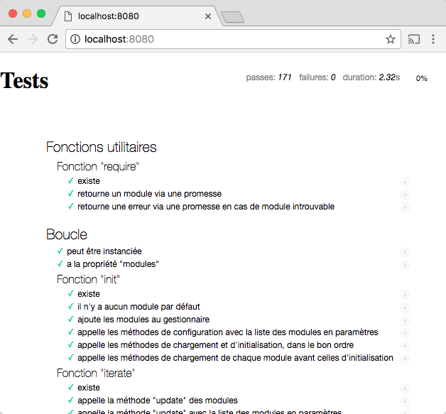
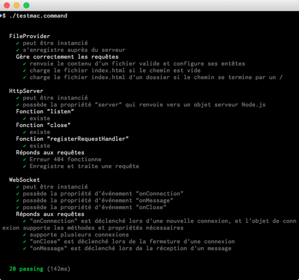

# MoteurJS: Moteur de jeu en JavaScript à vocation pédagogique

Élaboré dans le cadre des programmes de [Baccalauréat avec majeure en conception de jeux vidéo](http://programmes.uqac.ca/6908) et de [Maîtrise en informatique (jeux vidéo)](http://programmes.uqac.ca/1537) de l'[Université du Québec à Chicoutimi](http://www.uqac.ca/), ce projet se veut être un outil pédagogique permettant d'offrir aux étudiants et enseignants un moteur de jeu vidéo à code ouvert et simple à comprendre et à modifier.

L'atteinte de ces objectifs oriente les choix technologiques vers les technologies Web modernes et standardisées, de plus en plus puissantes, en utilisant le langage JavaScript. On profite ainsi d'une documentation exhaustive et d'un support généralisé sur la majorité des systèmes d'exploitation modernes, et ce, sans nécessiter de compilateurs ou autres logiciels spécialisés.

Il existe plusieurs manières de structurer un moteur, celle choisie ici est basée sur le modèle [Entités-Composants-Systèmes](http://guillaume.belz.free.fr/doku.php?id=ecs), utilisé entre autre (avec adaptations) par les moteurs commerciaux modernes tels que [Unity](https://unity3d.com/fr/) et [Unreal Engine](https://www.unrealengine.com).

L'emphase sur une utilisation pédagogique guide certains choix de programmation et de design, favorisant la simplicité avant tout. Ce choix peut parfois mener à des gestion d'erreurs discutables ou à des sacrifices quant aux structures et aux performances.

Toujours dans le même ordre d'idée, la totalité du code moteur est développé à l'aide de méthodologie de [développement piloté par les tests](https://fr.wikipedia.org/wiki/Test_driven_development), présentant ainsi un cas d'usage pour chaque fonctionnalité intégrée au projet.

## Débuter

Il est possible d'obtenir une copie de ce projet via sa [page GitHub (https://github.com/elaberge/moteurjs)](https://github.com/elaberge/moteurjs) en le clonant via `git` ou en téléchargeant directement la [plus récente archive (https://github.com/elaberge/moteurjs/archive/master.zip)](https://github.com/elaberge/moteurjs/archive/master.zip).

### Prérequis

Afin d'exécuter le code serveur, si on désire utiliser les fonctionnalités de communication réseau, une installation de [Node.js](https://nodejs.org/fr/), en version courante, est nécessaire.

Pour des raisons de sécurité, plusieurs navigateurs refusent de charger des fichiers de façon asynchrone lorsque le protocole de fichiers locaux est utilisé (adresses de type `file://`). Malgré la possibilité de faire certaines manipulations complexes, il peut être plus simple d'installer un serveur Web.

#### Installation d'un serveur Web simple

Avec Node.js installé précédemment, depuis l'invite de commande du système d'exploitation, installer le serveur [http-server](https://github.com/indexzero/http-server) via la commande:

    npm install -g http-server

Selon le système d'exploitation, il est possible d'avoir à exécuter la commande avec des droits d'administrateur afin que l'installation fonctionne correctement.

Finalement, depuis le dossier de projet, exécuter le serveur, en spécifiant le port d'écoute:

    http-server -c-1 -p 8080

Dans cet exemple, on spécifie le port d'écoute *8080* (les fichiers seront donc disponibles via l'URL [http://localhost:8080/](http://localhost:8080/)), et l'option *-c-1* indique de ne pas conserver les fichiers en cache, ce qui est utile pour le développement.

### Installation

Le projet principal ne nécessite pas de procédures d'installation particulière, et devrait fonctionner tel quel.
Le code du serveur nécessite par contre certains modules supplémentaires, s'installant simplement à l'aide du gestionnaire de paquetages de Node.js.

Depuis une invite de commande du système d'exploitation, naviguer vers le dossier `server` du projet, et exécuter la commande d'installation des dépendances

    npm install

## Exécution des tests

Le projet étant développé par la méthodologie de développement piloté par les tests, un accent particulier est mis sur la simplicité d'exécution des tests. On y retrouve ainsi deux suites de tests soit une pour les fonctionnalités s'exécutant dans le navigateur Web, et une pour le code serveur.

### Suite Web

À l'aide d'un navigateur Web, s'assurer de démarrer un serveur Web local et ouvrir la page [`index.html`](http://localhost:8080/index.html) à la racine du projet. Une page intitulée *Tests* devrait apparaître, et afficher en son contenu:

### Suite serveur

Depuis une invite de commande du système d'exploitation, naviguer vers le dossier `server/tests` du projet, et exécuter la commande de tests appropriée (*testlinux.sh*, *testmac.command*, *testwin.bat* pour Linux, MacOS et Windows, respectivement). Si l'installation est conforme, les tests devraient s'exécuter avec succès.

## Projets de démonstration

Certains projets de démonstration sont disponibles avec le projet, afin de présenter les différentes fonctionnalités et cas d'utilisation.

### Pong

Une implémentation du jeu classique *Pong* est disponible via le fichier [`pong/index.html`](http://localhost:8080/pong/index.html).

Ce projet présente les modules:
- de graphismes vectoriels 2D
- d'audio
- d'entrées clavier

Il s'agit d'un projet simple avec peu de composants permettant de constater la mise en oeuvre d'un jeu à l'aide de ce projet. Les fichiers [`pong/pong.js`](pong/pong.js) et [`pong.json`](pong/pong.json) sont particulièrement d'intérêt.

### Démo de serveur

Un serveur de jeu minimaliste est disponible dans le dossier `server/demo`. Ce serveur fournit les fichiers demandés au navigateur depuis son propre répertoire, et affiche les connexions et requête WebSocket sur la console.

On peut le lancer depuis l'invite de commande du système d'exploitation via la commande appropriée (*serverlinux.sh*, *servermac.command*, *serverwin.bat* pour Linux, MacOS et Windows, respectivement), et ouvrir un navigateur pour atteindre le fichier [`index.html`](http://localhost:8081/index.html). On peut ainsi observer les interactions WebSocket entre la page Web et le serveur.

## Améliorations

* Ajouter le support pour le 3D
* Ajouter des projets de démonstration supplémentaires pour exposer l'ensemble des fonctionnalités
* Améliorer la documentation du code
* Rédiger des tutoriels pour les opérations courantes:
  - Ajout d'une nouvelle fonctionnalité au moteur (par exemple, modules pour les Behavior Trees)
  - Création d'un jeu à partir de zéro
  - Exemples d'exercices possibles à l'aide du projet

## Technologies externes utilisées

* [IndexedDB Promised](https://github.com/jakearchibald/indexeddb-promised) - Bibliothèque asynchrone pour l'accès à la base de donnée IndexedDB
* [RequireJS](http://requirejs.org/) - Gestion et chargement de modules JavaScript
* [Mocha](https://mochajs.org/) - Tests unitaires
* [Chai Assertion Library](http://chaijs.com/) - Fonctionnalités d'assertions pour les tests unitaires
* [Node.js](https://nodejs.org/fr/) - Code serveur
* [ws](https://github.com/websockets/ws) - Bibliothèque WebSocket pour Node.js
* [Markdown Licenses](https://github.com/IQAndreas/markdown-licenses) - Licence en format Markdown

## Références

Console JavaScript du navigateur:
- [Firefox](https://developer.mozilla.org/fr/docs/Outils/Console_Web)
- [Chrome](https://developers.google.com/web/tools/chrome-devtools/debug/console/console-ui)
- [Safari](https://developer.apple.com/safari/tools/)
- [Internet Explorer](https://msdn.microsoft.com/en-us/library/dn255006%28v=vs.85%29.aspx)
- [Edge](https://developer.microsoft.com/en-us/microsoft-edge/platform/documentation/f12-devtools-guide/console/)

[Objet console](https://developer.mozilla.org/fr/docs/Web/API/Console)

## Auteur

* **Eric Laberge** - *Développement principal* - [elaberge](https://github.com/elaberge)

## Licence

Ce projet visant une utilisation pédagogique, il est souhaité que les ajouts et modifications soient partagées en retour afin d'en faire profiter la communauté. Ainsi, ce projet est distribué sous une licence LGPL 3. Voir le fichier [LICENSE.md](LICENSE.md) pour plus de détails.

## Remerciements

* Le Comité de liaison institutionnel de l'[Université du Québec à Chicoutimi](http://www.uqac.ca/)
* La direction du [Module d'informatique et de mathématique](http://www.uqac.ca/dim/)
